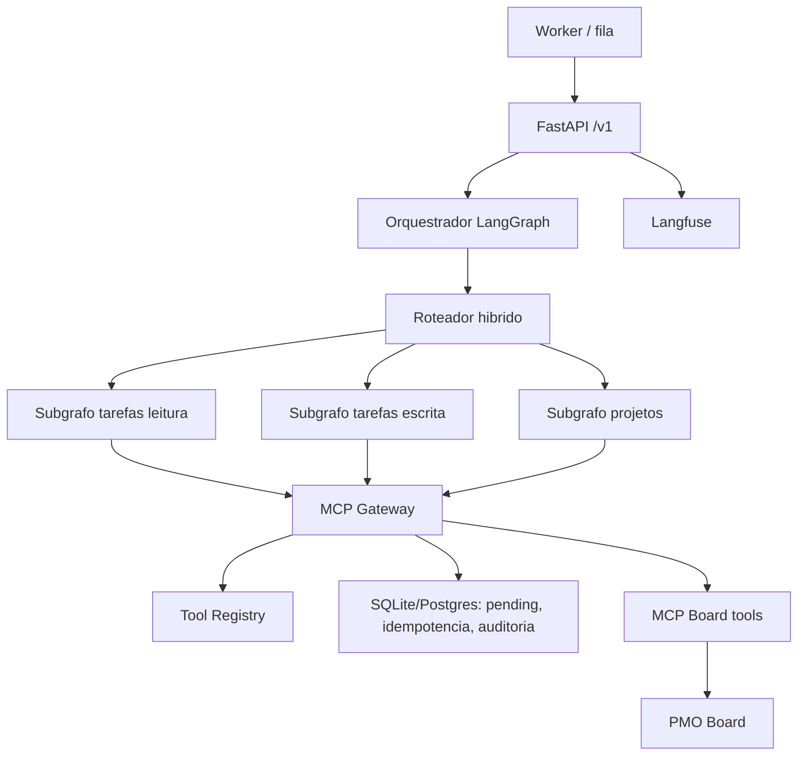

# Arquitetura v1 do PMO AI Agent

Esta versao adiciona uma arquitetura workflow-first sem remover os endpoints legados.

## Componentes



## Fluxo de mensagem

1. `POST /v1/agent/messages` recebe mensagem, `thread_id`, canal e metadata.
2. Identidade e correlacao entram por headers autenticados.
3. O grafo carrega contexto, normaliza mensagem e tenta roteamento deterministico.
4. Se a regra nao for confiavel, o classificador LLM retorna structured output Pydantic.
5. A intencao e roteada para subgrafo de tarefas, escrita ou projetos.
6. O subgrafo seleciona uma tool registrada e chama apenas o `MCPGateway`.
7. Escritas criam pending action e retornam `awaiting_confirmation`.
8. `POST /v1/agent/confirmations` retoma pelo `thread_id` e executa a escrita se a confirmacao for explicita.

## Tool registry

Tools registradas:

- `board_search_tasks`: leitura, `board.read`.
- `board_search_users`: leitura, `board.read`.
- `board_get_task`: leitura, `board.read`.
- `board_get_project_status`: leitura, `board.read`.
- `board_list_blockers`: leitura, `board.read`.
- `board_list_my_tasks`: leitura, `board.read`.
- `board_create_task`: escrita, `board.write`, confirmacao obrigatoria.
- `board_update_task`: escrita, `board.manage`, confirmacao obrigatoria.
- `board_move_task`: escrita, `board.manage`, confirmacao obrigatoria.
- `board_add_comment`: escrita, `board.write`, confirmacao obrigatoria.

O LLM nunca escolhe uma tool arbitraria. A tool vem do mapeamento interno de intencao para registry.

## Confirmacao e retomada

O fluxo usa pending actions persistidas como mecanismo de retomada por `thread_id`.

Estados:

- `pending`: aguardando confirmacao.
- `approved`: executado pela rota de confirmacao.
- `rejected`: cancelado, sem chamada MCP.

A API aceita confirmacao textual explicita, como `sim`, `confirmo`, `confirmar`, `pode executar` e `aprovar`. Mensagens ambiguas nao executam escrita.

## Idempotencia

O gateway gera uma chave SHA-256 para escritas usando:

```text
tenant_id:request_id:tool_name:entity_id:hash(argumentos)
```

O resultado fica persistido em `agent_idempotency_records`. Se a mesma operacao for reprocessada com a mesma chave e mesmos argumentos, o gateway retorna o resultado persistido.

## Read-after-write

Depois de confirmada a escrita, a API tenta `board_get_task` quando ha identificador da tarefa. Se a escrita aconteceu mas a leitura final falha, a resposta permanece `completed`, com indicacao de resultado parcial em `data.read_after_write`.

## Limitacoes reais

- O arquivo `/opt/shared/mcp/board_pmo.md` nao estava disponivel neste ambiente local. A implementacao usa a allowlist central exigida e mantem a leitura dinamica antiga para producao.
- Checkpointer PostgreSQL nativo do LangGraph nao foi ativado porque a infraestrutura/migracao dedicada nao existe no repositorio. A retomada operacional foi implementada via pending actions persistidas.
- O lock por `tenant_id + thread_id` e em memoria. Redis pode substituir essa camada quando existir na stack.
