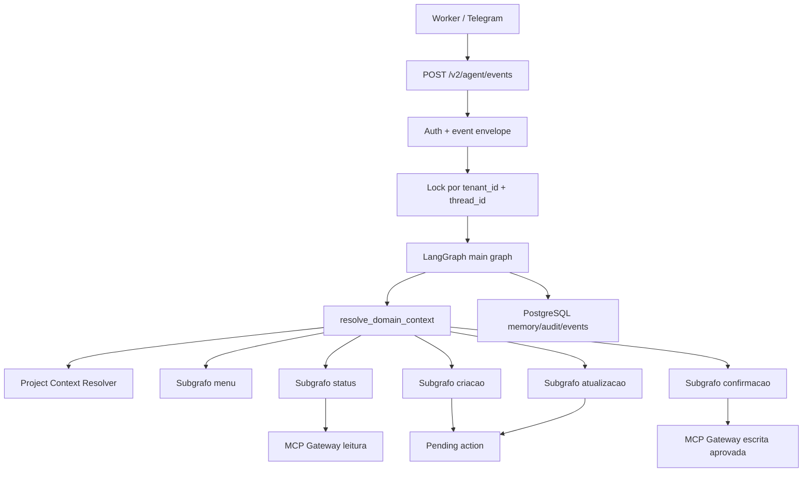
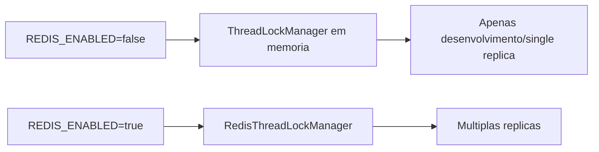

# Arquitetura V2 do PMO Agent

## Visao Geral

A API v2 transforma a IA em uma camada conversacional orientada a estado. O worker continua responsavel por Telegram, fila, debounce e renderizacao; a API passa a manter memoria, menus, mapas de selecao, rascunhos, pending actions, confirmacoes e auditoria.



## Persistencia

PostgreSQL e a fonte de verdade em producao. As tabelas novas ficam modeladas em `app/storage/repository.py` e migradas por Alembic em `app/infrastructure/database/migrations`.

Tabelas principais:

- `agent_threads`: estado resumido por `tenant_id + thread_id`.
- `agent_task_selection_maps`: mapa temporario numero -> `task_id`.
- `agent_drafts`: rascunhos de criacao e atualizacao.
- `pending_actions`: evoluida para payload v2, operacoes, expiracao, status e versao.
- `agent_events`: replay/idempotencia de `event_id`.
- `agent_graph_checkpoints`: checkpoint serializavel preparado para LangGraph.

## Domain Context

O V2 usa `PmoContext`/`ToolExecutionContext` para manter a linguagem de dominio alinhada ao Board:

- `tenant_id`: obrigatorio em toda execucao.
- `project_id`: obrigatorio para tarefas, status, bloqueios e minhas tarefas.
- `portfolio_id`: opcional, persistido somente quando retornado na resolucao de projeto.
- `activity_id`: obrigatorio para leitura/alteracao/comentario/movimentacao de atividade.

Depois de `validate_event`, `load_identity` garante o tenant antes de qualquer operacao de dominio. Em seguida, `resolve_domain_context` combina `metadata.project_id`, projeto ativo da sessao e referencia textual do usuario. Quando recebe nome de projeto, o resolver consulta `board_search_projects` se a tool existir. Se houver ambiguidade, o agente pede escolha e nao chama tools globais.

O resumo persistido em `agent_threads.state_summary` guarda apenas identificadores:

```json
{
  "active_tenant_id": "tenant-1",
  "active_project_id": "project-123",
  "active_portfolio_id": "portfolio-1",
  "active_activity_id": "activity-9"
}
```

Assim, uma conversa pode trocar de projeto explicitamente e as mensagens seguintes usam o ID ativo sem reconsultar o nome como fonte de verdade.

## MCP Gateway

A v2 reaproveita o gateway existente:

- registry allowlist;
- schemas Pydantic por tool;
- permissao por roles;
- retry apenas para leitura;
- escrita sem retry automatico;
- idempotencia por operacao;
- auditoria de tool call;
- read-after-write apos confirmacao.

Antes de validar a tool, o gateway canonicaliza aliases internos (`id`/`task_id` para `activity_id`, `projectId` para `project_id`) e injeta `tenant_id` e `project_id` vindos do contexto resolvido. Chamadas project-aware sem projeto geram `PROJECT_NOT_FOUND` e nao chegam ao executor MCP.

No boundary `BoardTools`, os payloads enviados ao MCP usam camelCase:

```json
{
  "tenantId": "tenant-1",
  "projectId": "project-123",
  "activityId": "activity-9",
  "idempotencyKey": "..."
}
```

Writes geram uma `idempotencyKey` deterministica por operacao logica. A chave e separada de `correlation_id`: a correlacao acompanha o trace inteiro, enquanto a idempotencia protege cada mutation (`create`, `update`, `comment`, `move`) contra duplicidade.

Tools permitidas seguem restritas a:

`board_search_tasks`, `board_search_users`, `board_get_task`, `board_create_task`, `board_update_task`, `board_move_task`, `board_add_comment`, `board_get_project_status`, `board_list_blockers`, `board_list_my_tasks`.

## Seguranca

Todos os endpoints v2 exigem `Authorization: Bearer <AGENT_API_TOKEN>`. Em producao, `AGENT_API_TOKEN` e `DATABASE_URL` PostgreSQL sao obrigatorios. O valor padrao de roles e vazio; roles enviadas por header so fazem sentido quando vindas do worker autenticado.

Redis e opcional para lock distribuido:



## Observabilidade

Langfuse recebe payloads sanitizados em traces raiz por evento do agente, spans por etapa do fluxo e generations para chamadas LLM de classificacao e extracao estruturada. O modulo `app/infrastructure/observability/metrics.py` declara os nomes preparados para Prometheus:

- `agent_events_total`
- `agent_event_duration_seconds`
- `agent_requests_total`
- `agent_latency_ms`
- `agent_flow_transitions_total`
- `agent_llm_calls_total`
- `mcp_calls_total`
- `agent_mcp_calls_total`
- `agent_confirmations_total`
- `agent_pending_actions_total`
- `agent_idempotency_hits_total`
- `agent_errors_total`

## Langfuse Self-Hosted

O `docker-compose.yml` inclui Langfuse v3 self-hosted com web, worker, PostgreSQL, ClickHouse, Redis e MinIO. O workflow `Deploy VPS` gera automaticamente as variaveis secretas ausentes no `.env` da VPS e configura a API para enviar traces para `http://langfuse-web:3000`. A API aceita `LANGFUSE_HOST` ou o nome oficial `LANGFUSE_BASE_URL`.
As senhas geradas pelo workflow usam hexadecimal para evitar caracteres especiais que quebram a URL de migracao do ClickHouse no Langfuse.

Na VPS, a UI fica exposta por padrao em:

```text
http://<VPS_HOST>:3000
```

As credenciais iniciais e chaves do projeto ficam no `.env` preservado da VPS:

```text
LANGFUSE_INIT_USER_EMAIL
LANGFUSE_INIT_USER_PASSWORD
LANGFUSE_INIT_PROJECT_PUBLIC_KEY
LANGFUSE_INIT_PROJECT_SECRET_KEY
```
