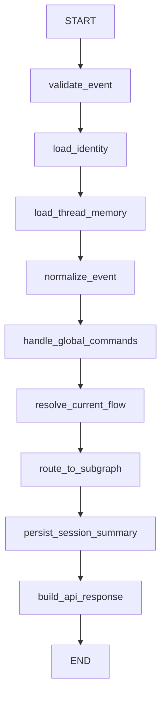
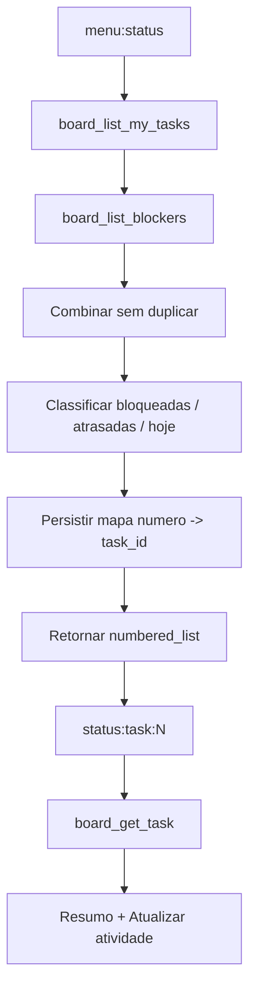
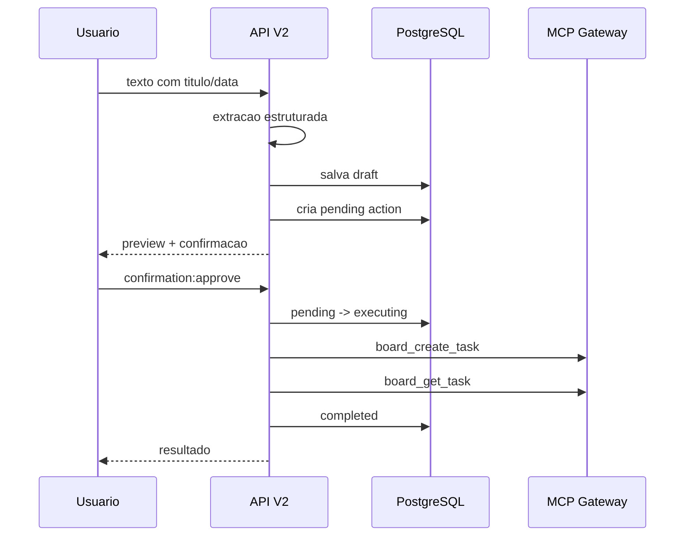

# Fluxos Conversacionais V2

## Grafo Principal



Comandos globais aceitos em qualquer fluxo: `cancelar`, `voltar`, `menu`, `inicio`, `reiniciar`, alem dos callbacks `global:cancel`, `global:back`, `global:menu`, `global:reset`.

## Menu

Deterministico. `welcome` ou `global:menu` retorna:

- Status: `menu:status`
- Criar atividade: `menu:create`
- Atualizar atividade: `menu:update`
- Duvidas: `menu:questions`

## Status



O numero exibido nunca e tratado como ID real. Ele e resolvido por `agent_task_selection_maps`.

## Criacao



Obrigatorios: `title`, `due_date`. Opcionais: `description`, `assignee`, `priority`, `project_id`.

## Atualizacao

Entradas aceitas:

- selecionar por lista `update:list_tasks` + `update:task:N`;
- enviar indice numerico atual;
- enviar codigo real do board;
- buscar por texto, com lista de escolha quando ambiguo.

Campos liberados agora:

- `due_date`
- `assignee`, apenas quando resolvido com seguranca
- `comment`

Uma mensagem pode gerar varias operacoes. Exemplo:

```json
[
  {
    "tool_name": "board_update_task",
    "arguments": {
      "task_id": "TASK-123",
      "fields": {"due_date": "2026-07-17"}
    }
  },
  {
    "tool_name": "board_add_comment",
    "arguments": {
      "task_id": "TASK-123",
      "comment": "Aguardando retorno do CRM."
    }
  }
]
```

## Confirmacao

Estados persistidos: `pending`, `executing`, `completed`, `partial`, `rejected`, `expired`, `failed`, `unknown`.

Callbacks:

- `confirmation:approve:{id}`
- `confirmation:edit:{id}`
- `confirmation:reject:{id}`

Textos aceitos deterministamente:

- aprovacao: `sim`, `confirmo`, `confirmar`, `pode executar`, `aprovar`;
- rejeicao: `nao`, `cancelar`, `rejeitar`, `nao confirmar`.

Confirmacao reutilizada, expirada, de outro usuario, outra thread ou outro tenant nao executa escrita.

## Duvidas

Fluxo mockado por enquanto. Nao chama LLM nem MCP e retorna apenas `Voltar ao menu`.
