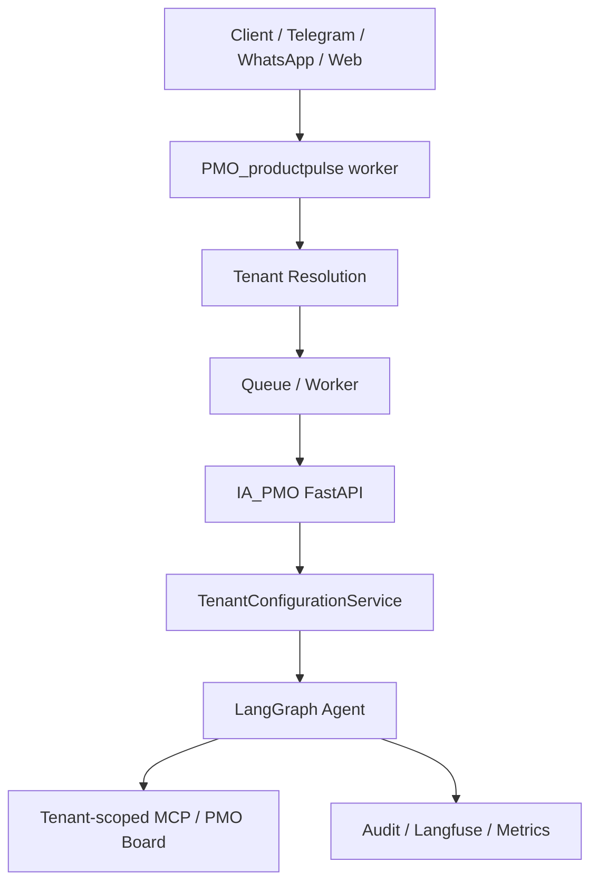

# Multi-Tenant Architecture

This repository now contains the IA_PMO control plane foundation for tenant-aware configuration.

## Current implementation

- `tenants` is the root control-plane entity.
- Tenant-scoped configuration is stored in dedicated tables for branding, users, roles, channels, AI config, policies, integrations, rate limits, secrets and feature flags.
- Runtime request context is represented by immutable `TenantContext`.
- Admin APIs live under `/admin/v1/tenants`.
- Configuration can be published into immutable snapshots and rolled back.
- Tenant secrets are encrypted with AES-GCM using `ENCRYPTION_KEY`.

## Compatibility

Existing agent endpoints remain available. When a caller omits `X-Tenant-ID`, the app falls back to `AGENT_DEFAULT_TENANT_ID`, which defaults to `default`.
